

    

# Challenge Conversor | Oracle + Alura 💱🌡️📏
_Conversor de divisas, temperaturas y medidas de longitud. Desarrollado en Java con el IDE Eclipse y el framework Swing. El proyecto fue desarrollado en la formacion de backend con Java del programa Oracle Next Education en colaboracion con Alura._

## Comenzando 🚀
_Estas instrucciones te permitirán obtener una copia del proyecto en funcionamiento en tu máquina local para propósitos de desarrollo y pruebas._

### Pre-requisitos 📋
JDK (Java Development Kit) - [Descargar](https://www.oracle.com/java/technologies/javase-downloads.html)
Eclipse IDE - [Descargar](https://www.eclipse.org/downloads/)

### Ejecutar desde Eclipse 📦
1. Clonar el repositorio
2. Abrir Eclipse
3. Importar el proyecto
4. Ejecutar el proyecto

### Ejecutar desde el archivo .jar 📦
1. Clonar el repositorio
2. Abrir la carpeta "dist"
3. Ejecutar el archivo "conversor-ejecutable.jar"

## Uso 📌
### Conversor de divisas 💱
1. Seleccionar la opcion de "Conversor de Monedas"

    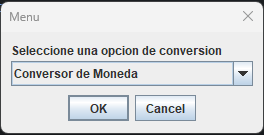

2. Introducir la cantidad de dinero que desea convertir

    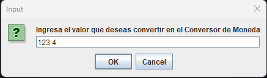

3. Seleccionar la moneda de origen y destino del menu desplegable

    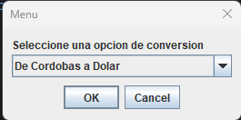

4. Presionar "OK" para obtener el resultado

    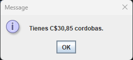

---

### Conversor de temperaturas 🌡️
1. Seleccionar la opcion de "Conversor de Temperaturas"

    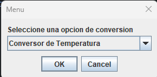

2. Introducir la cantidad de grados que desea convertir

    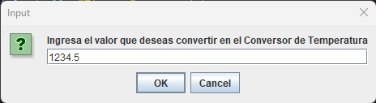

3. Seleccionar la unidad de origen y destino del menu desplegable

    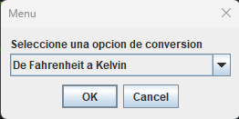

4. Presionar "OK" para obtener el resultado

    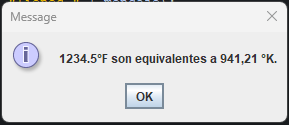

---

### Conversor de unidades de longitud 📏
1. Seleccionar la opcion de "Conversor de Unidades de Longitud"

    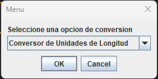

2. Introducir la cantidad que desea convertir

    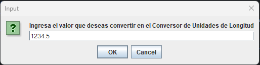

3. Seleccionar la unidad de origen y destino del menu desplegable

    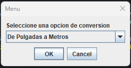

4. Presionar "OK" para obtener el resultado

    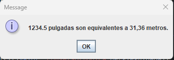

## Construido con 🛠️
* [Java](https://www.java.com/es/) - Lenguaje de programacion
* [Swing](https://docs.oracle.com/javase/7/docs/api/javax/swing/package-summary.html) - Framework para interfaces graficas

## Autores ✒️
* **María Fernanda Jovel** - _Autor principal_

## Licencia 📄
Este proyecto está bajo la Licencia MIT - mira el archivo [LICENSE.md](LICENSE.md) para detalles

## Expresiones de Gratitud 🎁
* Comenta a otros sobre este proyecto 📢
* No olvides dejar una ⭐️ si te gusta el proyecto
* Sigueme en mis redes sociales 📌

---
⌨️ con ❤️ por [FerJovel](https://github.com/ferjovel06)